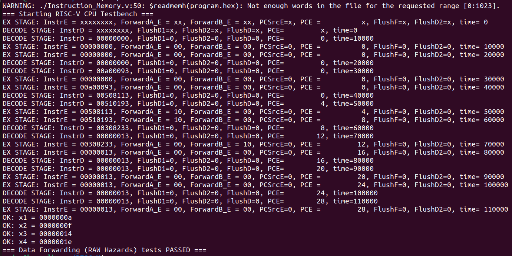
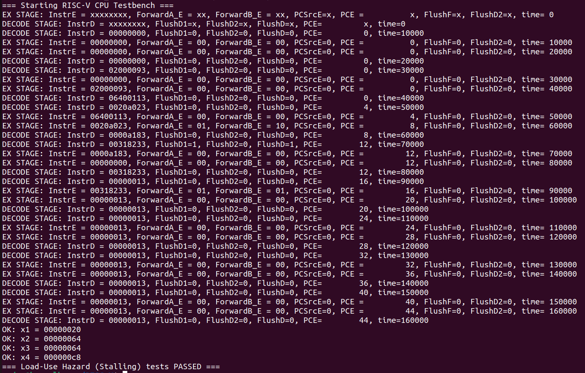
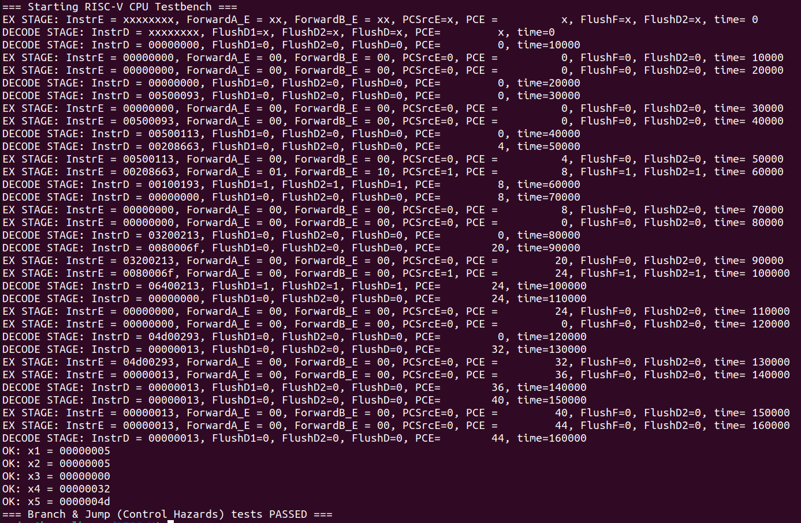
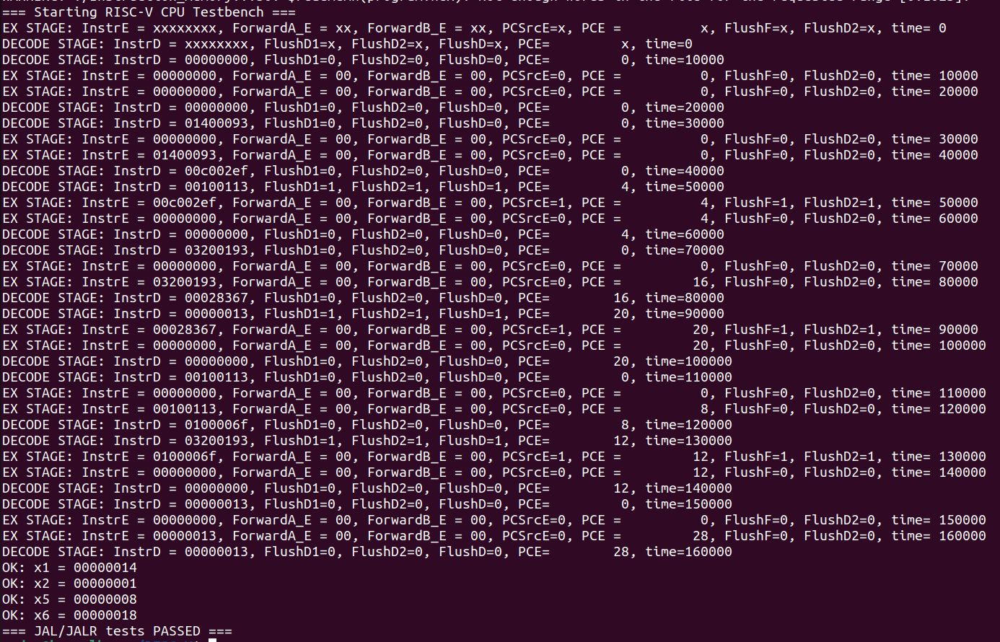

# 5-Stage Pipelined RISC-V CPU (RV32I)

## Project Overview
This repository contains a high-performance **5-stage pipelined RISC-V processor** implemented in Verilog. The design follows the RISC-V RV32I ISA and is engineered to handle various pipeline hazards using a dedicated Hazard Detection and Forwarding Unit. By resolving dependencies in hardware, the processor achieves a high Instructions Per Cycle (IPC) count.


## Key Architectural Features
* **Pipeline Stages:** Implements the classic five-stage architecture:
  1. **Fetch (IF):** Instruction fetching with "Static Not Taken" prediction.
  2. **Decode (ID):** Instruction decoding and Register File access with internal bypassing.
  3. **Execute (EX):** Arithmetic operations and branch/jump target calculation.
  4. **Memory (MEM):** Data memory read/write operations.
  5. **Writeback (WB):** Register file update with ALU, Memory, or Link data.

* **Hazard Management:**
    * **Data Forwarding:** Bypasses results from the MEM and WB stages to the EX stage to eliminate most RAW (Read-After-Write) hazards.
    * **Load-Use Stalling:** Automatically detects dependencies on `lw` instructions and inserts a 1-cycle hardware bubble by freezing the PC and IF/ID registers.
    * **Control Hazard Flushing:** Implements a 2-cycle pipeline flush (IF and ID) whenever a branch or jump is taken to maintain architectural consistency.

* **Branch Prediction:** Currently, the design has "Always Not Taken" Branch predictor, and flushes the pipeline if Branch has to be taken
* **Linking Logic:** Fully supports `JAL` and `JALR` instructions by calculating and storing the return address ($PC + 4$) into the destination register.

## 🛠 Supported Instructions
The processor handles a broad subset of the **RV32I** Base Integer Instruction Set:

| Type | Instructions |
| :--- | :--- |
| **R-Type** | `add`, `sub`, `and`, `or`, `slt` |
| **I-Type** | `addi`, `andi`, `ori`, `lw`, `jalr` |
| **S-Type** | `sw` |
| **B-Type** | `beq`, `bne`, `blt`, `bge`, `bltu`, `bgeu` |
| **J-Type** | `jal` |

---

## Timing Analysis

The design was synthesised using the Skywater 130nm PDK, using Yosys. Timinig analysis was done using the TritonSTA (OpenSTA-based), which is the default timing engine of OpenROAD.
The analysis should a positive slack of +1.2619 at a clock speed of 25ns (40MHz). Thus, we can safely inscrease the clock speed upto 42MHz (ensuring positive slack is met).

```
    Delay      Time   Description
-------------------------------------------------------------
   0.0000    0.0000   clock clk (rise edge)
   0.0000    0.0000   clock network delay (ideal)
   0.0000    0.0000 ^ _175148_/CLK (sky130_fd_sc_hd__dfrtp_1)
  14.7695   14.7695 ^ _175148_/Q (sky130_fd_sc_hd__dfrtp_1)
   7.0582   21.8277 v _123199_/Y (sky130_fd_sc_hd__nand2_1)
   1.5138   23.3415 v _123231_/X (sky130_fd_sc_hd__mux2_1)
   0.0000   23.3415 v _174912_/D (sky130_fd_sc_hd__dfrtp_1)
            23.3415   data arrival time

  25.0000   25.0000   clock clk (rise edge)
   0.0000   25.0000   clock network delay (ideal)
  -0.2000   24.8000   clock uncertainty
   0.0000   24.8000   clock reconvergence pessimism
            24.8000 ^ _174912_/CLK (sky130_fd_sc_hd__dfrtp_1)
  -0.1966   24.6034   library setup time
            24.6034   data required time
-------------------------------------------------------------
            24.6034   data required time
           -23.3415   data arrival time
-------------------------------------------------------------
             1.2619   slack (MET)
```

### Note : I will be trying to reduce the critical path delay, to inscrease the clock speed and update the design, as ad when time permits.

## Verification & Test Results
The design was rigorously verified through targeted assembly test cases. Below are the verified scenarios:

### 1. Data Forwarding (Priority Test)
Verified that the forwarding unit correctly prioritizes the MEM stage result over the WB stage result when a register is modified in back-to-back cycles.
```riscv
addi x1, x0, 10    # x1 = 10
addi x2, x1, 5     # x2 = 15 (Forward from EX/MEM)
addi x3, x2, 5     # x3 = 20 (Forward from EX/MEM)
add  x4, x1, x3    # x4 = 30 (Forward x1 from MEM/WB, x3 from EX/MEM)

```



### 2. Load-Use Hazard (Stalling)
Verified that the Hazard Unit correctly freezes the pipeline for 1 cycle when an instruction depends on a lw result.
```riscv
addi x1, x0, 32    # Base address for store
addi x2, x0, 100   # Value to store
sw   x2, 0(x1)     # Memory[32] = 100
lw   x3, 0(x1)     # x3 = 100
add  x4, x3, x3    # x4 = 200 (MUST STALL HERE)
```



### 3. Branch & Jump (Control Hazards)
Verified that the Flush happens in case of incorrect Branch Prediction/Jump
```riscv
addi x1, x0, 5
addi x2, x0, 5
beq  x1, x2, 12    # Offset 12: Jump to 'addi x4'
addi x3, x0, 1     # Should be FLUSHED
addi x3, x0, 2     # Should be FLUSHED
addi x4, x0, 50    # Target of Branch (PC 20)
jal  x0, 8         # Skip the next addi
addi x4, x0, 100   # Should be FLUSHED
addi x5, x0, 77    # Final landing spot


```



### 4. Jal/JalR Check
Verified JAL and JALR instructions
```riscv
addi x1, x0, 20    # Load 20 into x1 
jal  x5, 12        # Jump to PC (4 + 12) = 16. Save PC + 4 (8) into x5
addi x2, x0, 1     
jal x0, 16        # PC 12: Infinite loop 
addi x3, x0, 50    # PC 16: Subroutine starts here
jalr x6, 0(x5)    # PC 20: Return to address in x5 (8). Save PC + 4 (24) into x6

```


